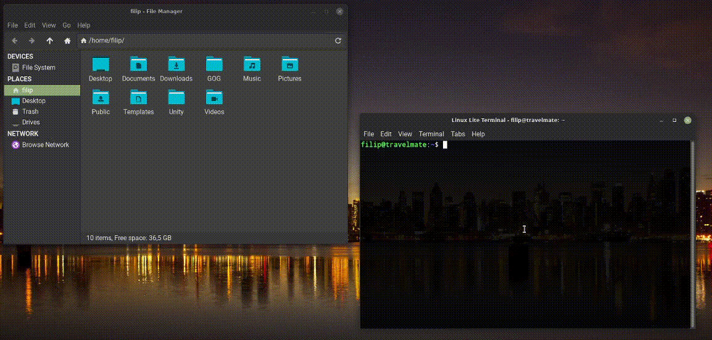

# Linux Custom
My options for a Linux distribution.

- Themes
    - Dark
    - Light
- More scripts
    - Theme
    - Github
    - Trans



## Install
How to install this a linux-custom, must by cloning the repository, and start this a install.sh script.

```bash
cd ~/Desktop &&
git clone https://github.com/filipvrba/linux-custom.git &&
./linux-custom/install.sh && rm -r linux-custom && cd -
```
